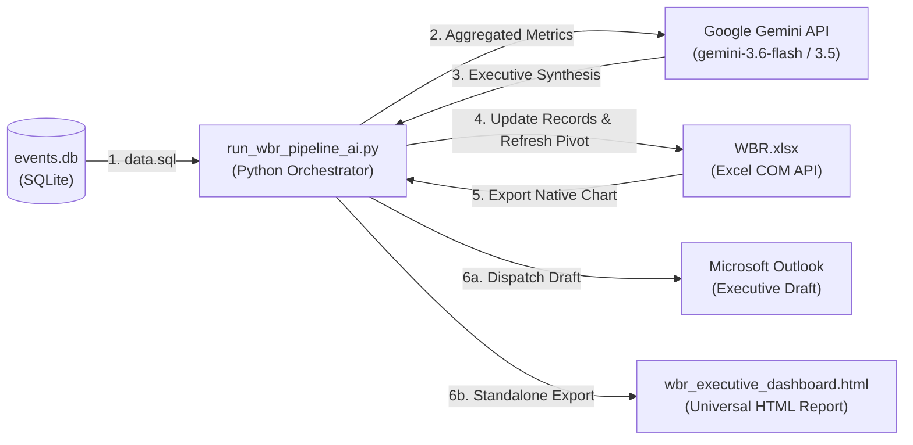

# Autonomous Executive Weekly Business Review (WBR) & AI Intelligence Pipeline

An end-to-end automated business intelligence system that queries operational metrics from an SQLite database, synthesizes an executive-grade narrative via Google Gemini Vision/Language LLMs, programmatically refreshes Microsoft Excel pivot tables and native charts via Windows COM, and dispatches an executive-ready dashboard into Microsoft Outlook or as a standalone responsive HTML report.

---

## 🏗️ Architecture & Workflow



---

## 🌟 Key Capabilities & Features

### 1. The 4-Stage Autonomous Pipeline (`run_wbr_pipeline_ai.py`)
1. **Stage 1 — SQL Ingestion Engine:**
   * Executes parameterized `data.sql` against `events.db` to pull time-series operational incident counts and categories.
2. **Stage 2 — AI Intelligence Synthesis Layer:**
   * Computes statistical aggregates (total event volume, category percentages, peak anomaly dates).
   * Prompts **Google Gemini API** (`gemini-3.6-flash`, with automatic failover to `gemini-3.5-flash`) to synthesize an executive-grade narrative:
     * **Top-Line Performance Summary:** Baseline volume vs. SLA stability.
     * **Critical Anomalies & Category Distribution:** Root cause concentration breakdown.
     * **Strategic Leadership Recommendations:** Actionable engineering and mitigation steps.
3. **Stage 3 — Office COM Automation:**
   * Programmatically launches headless Microsoft Excel via `win32com.client`.
   * Updates raw records in the `Data` sheet.
   * Silently refreshes the `Analysis` Pivot Table.
   * Extracts and exports the native trend chart from `Visualization` as a temporary high-resolution image.
4. **Stage 4 — Executive Delivery (Outlook Dispatch & Standalone HTML):**
   * **Corporate Windows Environment:** Initializes Outlook, attaches the native chart with inline CID (`cid:WBRChart`), and opens an executive HTML draft for review.
   * **Universal / CI/CD Fallback:** Automatically encodes the chart into Base64 and exports a standalone, responsive `wbr_executive_dashboard.html` directly to disk, ensuring 100% functionality even on non-Windows machines or headless servers.

---

## 📂 Project Structure

```text
📁 autonomous-executive-wbr-pipeline/
├── .env.example               # Clean configuration template (zero credentials)
├── .gitignore                  # Prevents secrets, logs, and temp images from git
├── data.sql                    # SQL aggregation query
├── events.db                   # Raw SQLite operational database
├── WBR.xlsx                    # Excel workbook with Data, Pivot, and Visualization tabs
├── run_wbr_pipeline_ai.py      # Main Python AI-augmented pipeline orchestrator
├── wbr_executive_dashboard.html# Exported standalone executive HTML dashboard
└── README.md                   # Comprehensive documentation and user manual
```

---

## 📖 Setup & Quick Start

### 1. Prerequisites
Ensure Python 3.10+ is installed:
```powershell
pip install requests python-dotenv pywin32 google-genai
```
*(Note: Microsoft Office is optional; if not installed, the pipeline automatically exports the standalone HTML dashboard without crashing).*

### 2. Configure Environment Variables
Copy `.env.example` to `.env`:
```powershell
cp .env.example .env
```
Open `.env` and set your free Gemini API key:
```env
GEMINI_API_KEY=your_gemini_api_key_here
DEFAULT_AI_MODEL=gemini-3.6-flash
EXECUTIVE_EMAIL_RECIPIENT=leadership-team@example.com
```

### 3. Run the Pipeline
```powershell
# Standard run (Attempts Outlook draft + generates HTML dashboard)
python run_wbr_pipeline_ai.py

# Headless / CI/CD mode (Exports standalone HTML dashboard)
python run_wbr_pipeline_ai.py --export-html
```

---

## 🛡️ Security & Open-Source Best Practices
* **Zero Secrets in Source Code:** All API keys are isolated in `.env` (strictly ignored by `.gitignore`).
* **Multi-Model Fault Tolerance:** Automatic fallback handling for temporary Google Gemini 503 high-demand spikes or rate limits.
* **Non-Destructive Execution:** Temporary exported images are cleaned up immediately following report generation.
